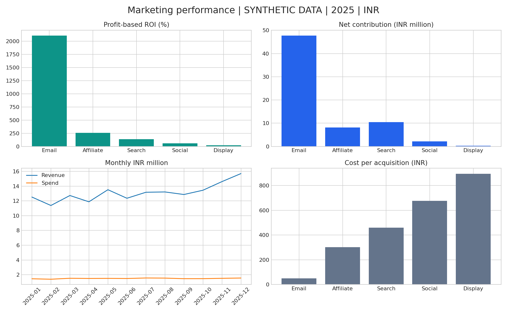

# Marketing Campaign & ROI Analytics

End-to-end Data Analyst portfolio project for Kavali Harshavardhan using Excel, SQLite, Python and Power BI setup assets.

**Synthetic data only.** This is a simulation, not a client engagement. No actual business growth or savings are claimed.



## Start here
1. Open `outputs/dashboard.html` in your browser. It works offline and includes channel/month filters.
2. Open `excel/Marketing_ROI_Analysis.xlsx` for editable source data, formula-based channel analysis and a linked chart.
3. Read `docs/FINAL_REPORT.md` for findings and limitations.
4. Follow `powerbi/BUILD_GUIDE.md` to create the native Power BI report. A `.pbix` is not included.
5. Follow `docs/GITHUB_SETUP.md` to publish your own repository.

## Reproduce the analysis
Python 3.10+ is recommended. From this folder:
```
python -m pip install -r requirements.txt
python src/analyze.py
```
The checked-in raw dataset is used on reruns. Delete it only if you want the seeded generator to recreate it. The pipeline cleans data, saves quarantine records, builds SQLite, executes SQL, reconciles Python/SQL, and regenerates charts, CSVs, HTML and the final report. Excel is a delivered snapshot with live formulas; source regeneration does not automatically refresh its source sheet. Replace clean sheet records to refresh it.

## Included
- `data/`: raw, clean and quarantined campaign-day CSVs.
- `sql/analysis.sql`: channel ROI, campaign ranking, month-over-month trend, audience analysis.
- `src/analyze.py`: seeded generator and reproducible analysis.
- `notebooks/EDA.ipynb`: executed notebook with exploratory summaries.
- `outputs/`: SQLite database, SQL results, KPI summaries, dashboard PNG and interactive HTML.
- `excel/`: formatted, formula-based analysis workbook.
- `powerbi/`: DAX measures, Power Query import, theme, data dictionary and dashboard instructions.
- `docs/`: final report, publishing instructions, resume bullets and interview notes.

## KPI methodology
CTR = clicks/impressions; CPC = spend/clicks; conversion rate = acquisitions/clicks; CPA = spend/acquisitions; ROAS = revenue/spend; ROI = (contribution profit before marketing − spend)/spend. Aggregate ratios use sums. Zero denominators produce nulls.

2025 dataset: 3,670 raw records, 20 duplicate removals, 15 quarantined records, 3,635 clean records. Assumed contribution margin: 55%. Simulated last-click, 7-day attribution. Acquisition counts are attributed first purchases, not cross-channel unique customers.

## Findings
Spend INR 17,946,461.73; attributed revenue INR 157,487,468.50; net contribution INR 68,671,646.55; ROAS 8.78x; ROI 382.6%. Email ranks highest by simulated ROI. These values reflect generator assumptions and must not guide actual spending.

## Validation and scope
SQL/Python channel results reconcile. The pipeline checks nonnegative values, funnel ordering and unique date/campaign keys. Dashboard filtering uses ratios of filtered totals. Fixed corporate costs and tax are excluded. No retention, customer lifetime value, causal lift or hiring outcome is claimed.

License: MIT for code. Generated data may be reused with a synthetic-data label.
