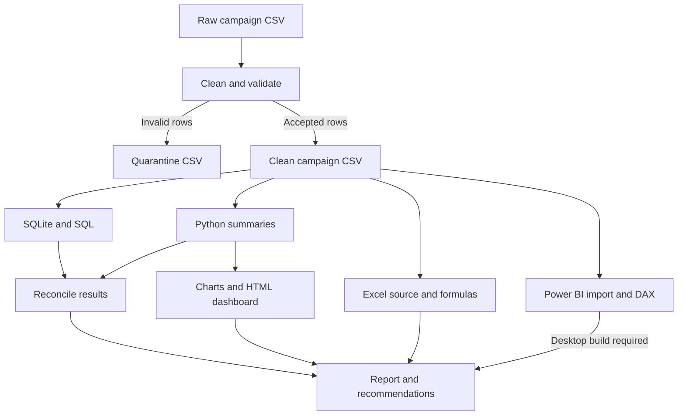
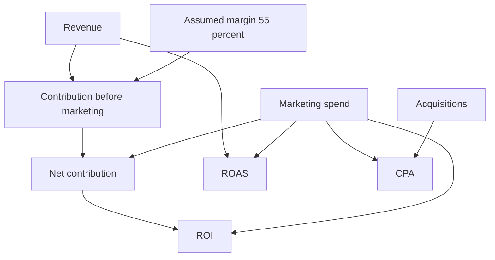
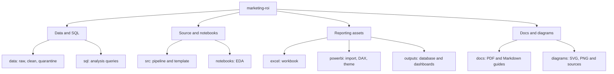

# Workflow, architecture and project structure

## Data processing and reporting

## KPI calculation dependencies

## Folder structure and responsibilities

The Excel workbook uses an embedded clean-data snapshot. Python refresh does not automatically update Excel. Power BI assets require a native Desktop report build. The HTML dashboard works offline with embedded data.
